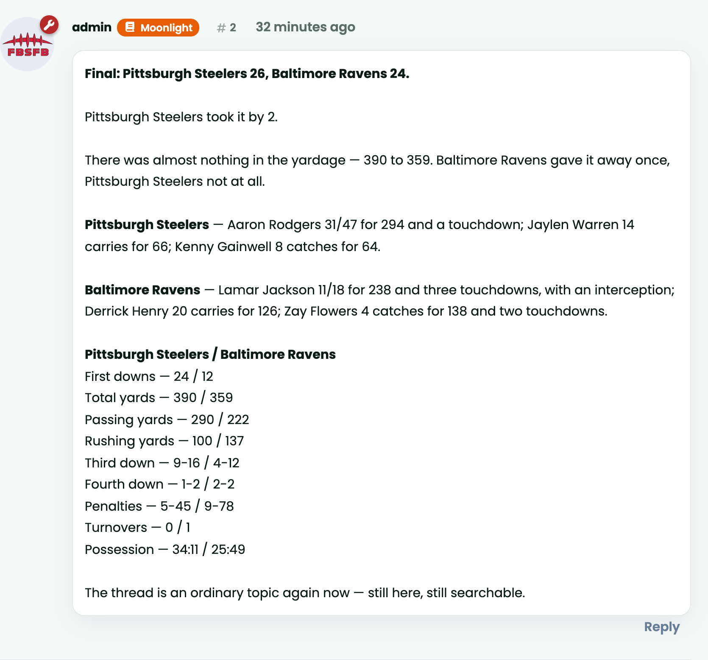
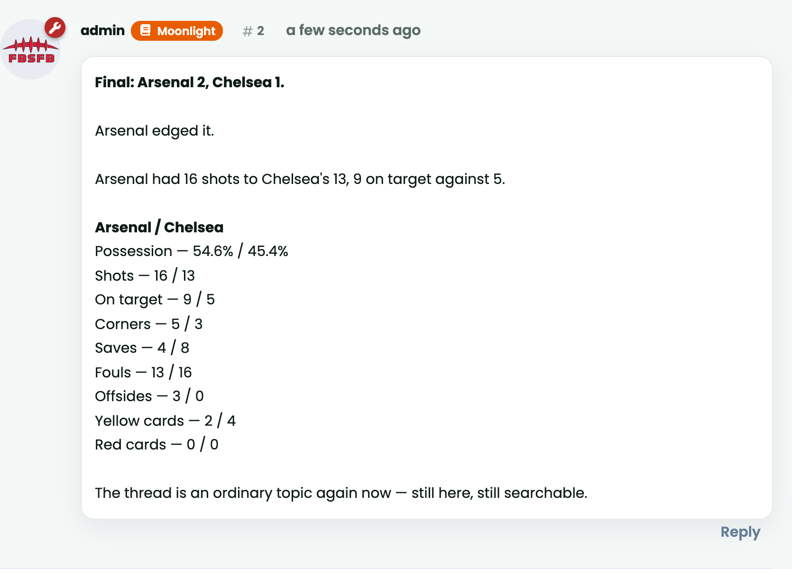

# Game Day

A thread for every game, opened before kickoff and finished with a recap that
says how the game was won.

Game Day reads the fixtures and box scores that
[Picks](https://github.com/ernestdefoe/picks) already syncs from
CollegeFootballData. It reaches nothing itself — Picks owns the provider, the
API key and the call budget, and one place is what makes a budget enforceable.

## What it does

**Opens a thread before kickoff.** An ordinary discussion, in the home team's
tag, three hours out by default. Ordinary is the point: it is quotable,
searchable, moderatable, and still there if this extension is removed.

**Says the game is on.** Flarum has no live state for a discussion, so this does
not pretend to have ported one — it sticks the thread while the game is being
played and unsticks it afterwards, which says the same thing in a way readers
already understand. Needs `flarum/sticky`; without it the setting says so.

**Finishes it with a recap that is worth reading.** A real one, written from a
real box score:



The recap is posted the moment a game settles and rewritten in place when the
box score arrives — the provider publishes statistics minutes to hours after the
final whistle, and waiting would delay the one thing everybody in the thread is
waiting for. A game the provider never covered simply keeps the score.

## More than one sport

The recap's *structure* is fixed — a score, a result, a sentence on how it went,
the players worth naming, a comparison — and its *words* come from the sport.

Here is the same code on a Premier League match, from the same afternoon:



American football talks about yards, turnovers and a quarterback's line. Soccer
talks about shots, possession and yellow cards, treats a draw as an ordinary
result rather than a curiosity, and names no players at all, because ESPN's
match summary carries no player breakdown to name one from. Basketball, baseball
and ice hockey each have their own words and their own thresholds — three points
is a rout in football and a coin toss in basketball.

Which sport a game is described in comes from **its season's league** in Picks,
so a board following the NFL and the Premier League gets both right on the same
Sunday. **Admin → Game Day → Sport** is the fallback, for a season created
before leagues existed.

Adding a league is a class implementing `Service\Sports\Sport` and one line in
`Service\Sports\Sports` — an extension can register its own without editing a
file it does not own, and the admin dropdown picks it up from the server rather
than from a second list in the JavaScript.

Everything below the score is earned. A yardage line is only printed when the
two are far enough apart to mean something; a turnover line only when somebody
actually lost the ball; a comparison line only when at least one side has the
figure. A recap that always has three sentences has three sentences of nothing
on the day nothing happened.

## Installing

```sh
composer require ernestdefoe/gameday
php flarum migrate
php flarum cache:clear
```

Then in **Admin → Game Day**: switch it on, set the member the threads are
posted as, and map each team to a tag. Nothing is posted until it is on, and
there is no default author on purpose — posting as whoever happens to be user 1
puts a founder's name on a hundred threads they did not write.

Two commands run on Flarum's scheduler and need nothing else:

- `gameday:tick` — every minute; opens, starts and resolves threads.
- `gameday:enrich` — hourly; fills out recaps whose box score has since arrived.

## Requires

- Flarum 2
- [`ernestdefoe/picks`](https://github.com/ernestdefoe/picks) for the fixtures
  and box scores
- `flarum/tags` (optional — threads are posted untagged without it)
- `flarum/sticky` (optional — the game-is-on state does nothing without it)

## Tests

The recap is a pure function of a game and its box score, so it is tested
without a database, a network or Flarum:

```sh
php tests/run.php
```

The box score is CollegeFootballData's real answer for that Notre Dame game,
normalised by Picks' own code rather than typed by hand. The same assertions run
on the Convoro build of Game Day, which is how the two are kept saying the same
things.

## Licence

MIT.
